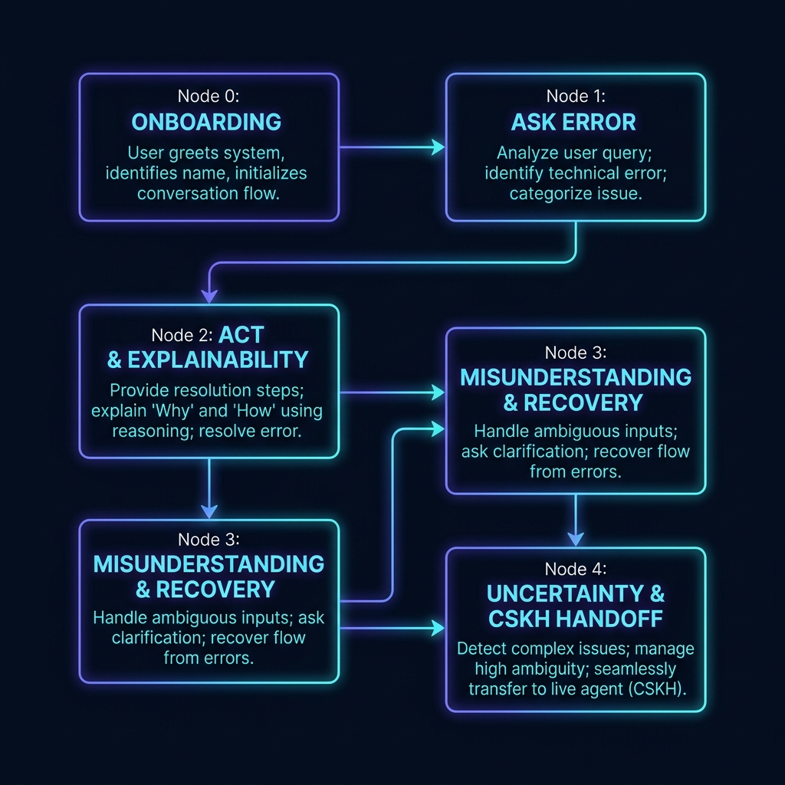
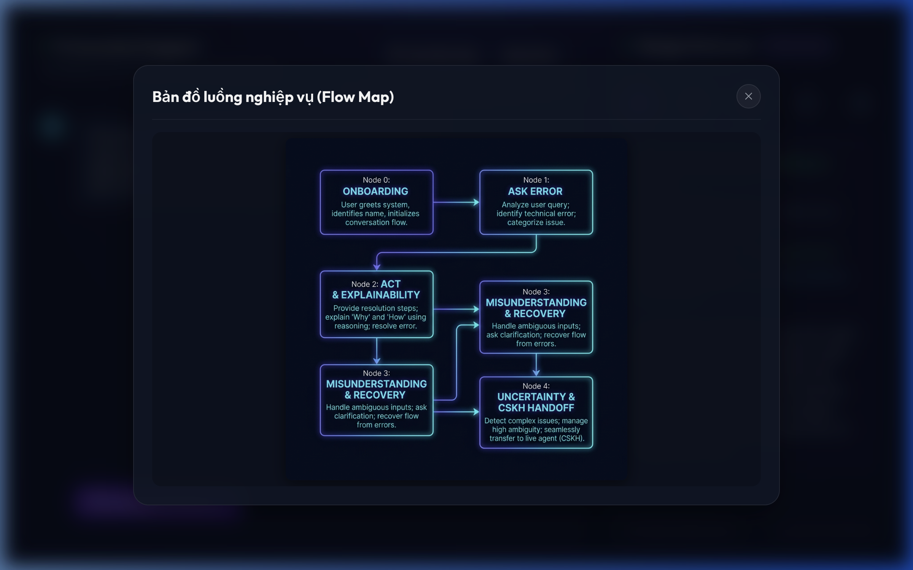
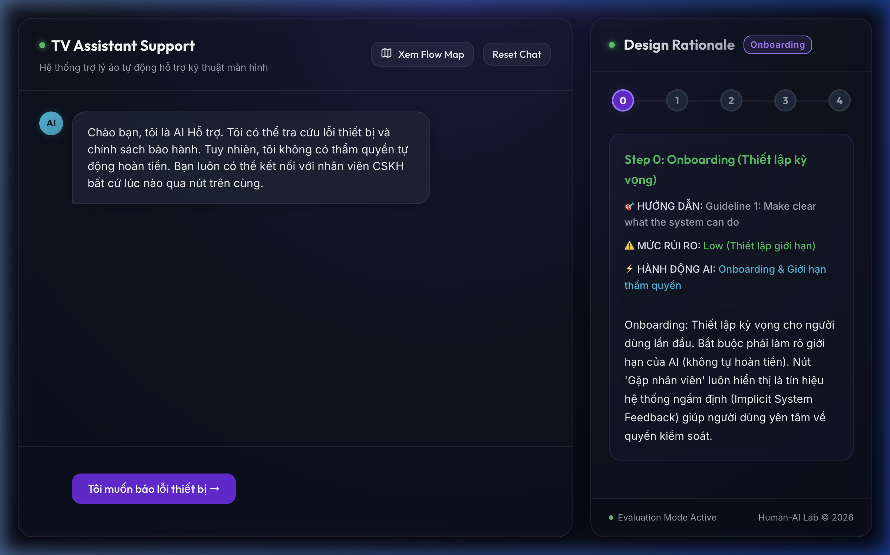
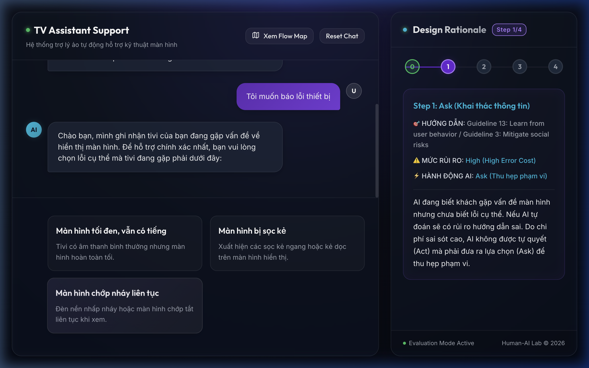
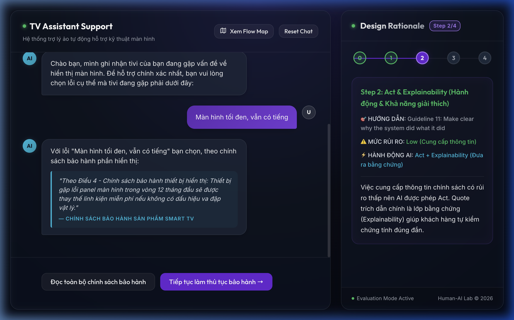
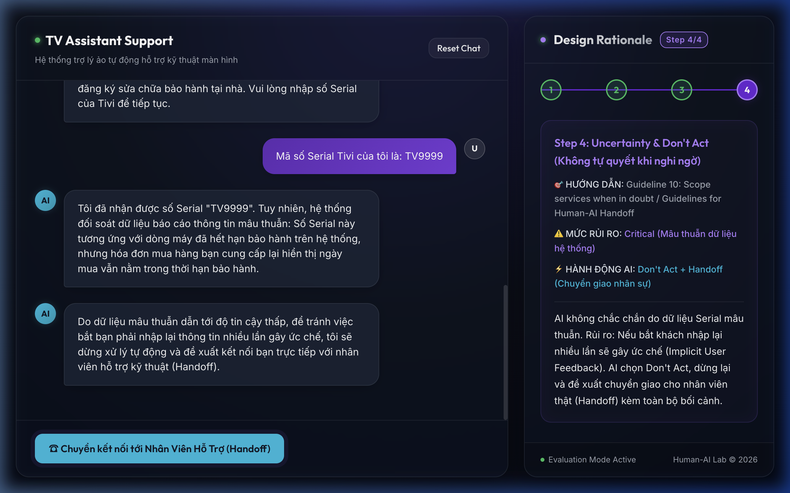
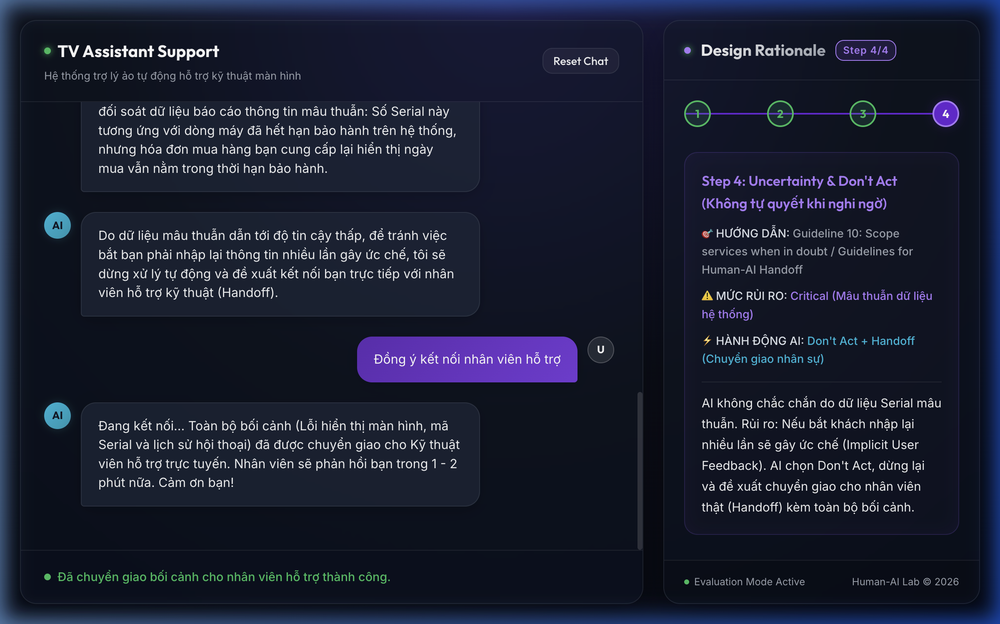
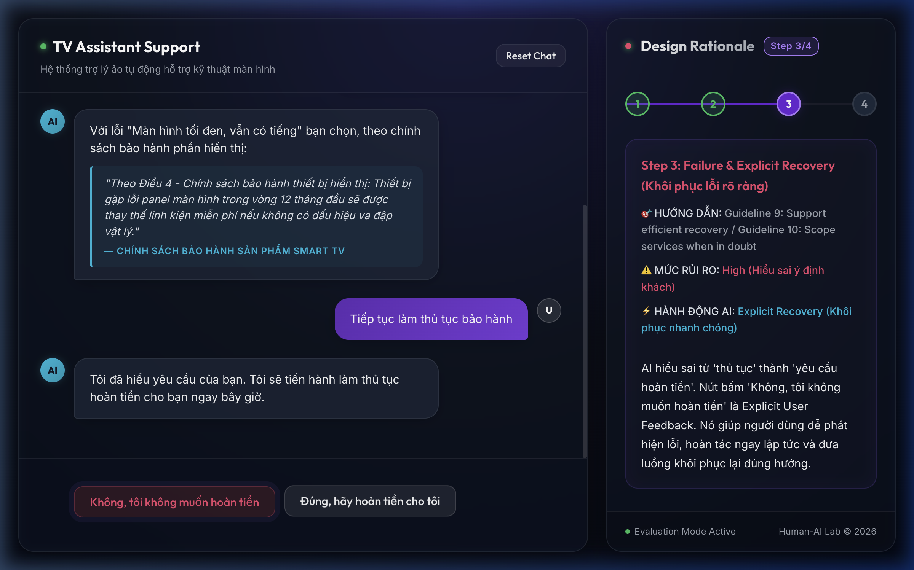
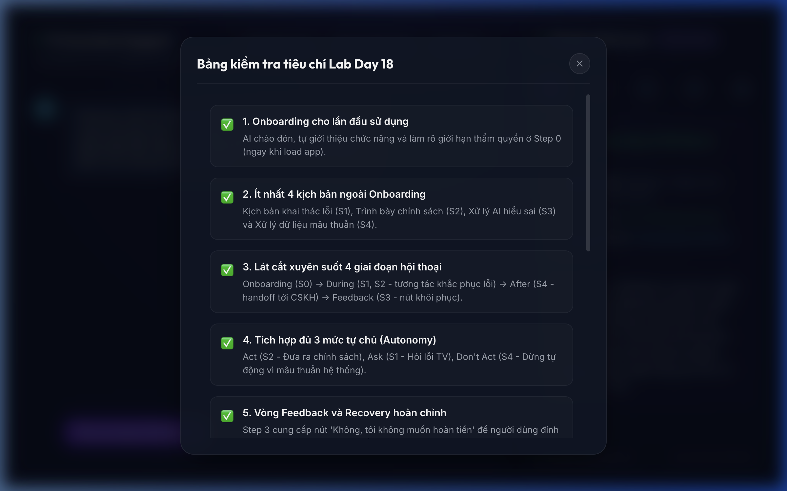
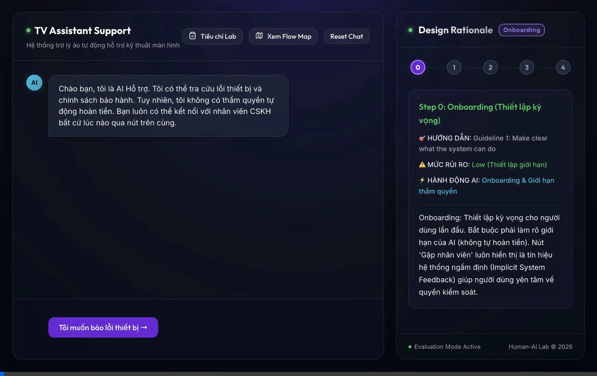

# BÁO CÁO KẾT QUẢ: GIAO DIỆN CHAT TƯƠNG TÁC & DESIGN RATIONALE

Họ và tên thành viên nhóm: Vũ Nhật Anh - 2A202600894, Nguyễn Lâm Phương Thảo - 2A202600873, Nguyễn Bình Huy - 2A202600689
Ngày thực hiện: 22/06/2026  
Dự án: Lab Day 18 - Thiết kế giao diện tương tác Người - Máy (Human-AI Interaction)

---
## 🔗 Liên kết & Hướng dẫn khởi chạy
### 1. Hướng dẫn khởi chạy cục bộ (Local Run)
Nếu giảng viên muốn chạy thử nghiệm trên máy cá nhân:
1. Mở terminal tại thư mục gốc của dự án.
2. Cài đặt các thư viện phụ thuộc bằng lệnh:
   ```bash
   npm install
   ```
3. Khởi chạy máy chủ phát triển bằng lệnh:
   ```bash
   npm run dev
   ```
4. Truy cập giao diện prototype tại địa chỉ trình duyệt: `http://localhost:5173/`
---

## 00 – Flow map và phạm vi tính năng

- **Mô tả**: Sơ đồ luồng nghiệp vụ chi tiết gồm 5 bước của hệ thống từ lúc đón tiếp người dùng cho đến khi giải quyết sự cố hoặc chuyển giao nhân viên kỹ thuật thực tế.
- **Minh chứng sơ đồ luồng**:
  
- **Minh chứng trên giao diện**:
  

---

## 01 – Onboarding

- **Mô tả (Step 0)**: Ngay khi khởi chạy ứng dụng, AI tự động gửi thông điệp chào đón và làm rõ giới hạn thẩm quyền của mình. Điều này giúp thiết lập kỳ vọng chính xác cho người dùng ngay từ đầu, giảm rủi ro hiểu nhầm.
- **Tin nhắn AI**: *"Chào bạn, tôi là AI Hỗ trợ. Tôi có thể tra cứu lỗi thiết bị và chính sách bảo hành. Tuy nhiên, tôi không có thẩm quyền tự động hoàn tiền..."*
- **Minh chứng giao diện**:
  

---

## 02 – Luồng chính / Trong hành động

- **Mô tả**: Luồng hoạt động chuẩn của trợ lý khi thu thập thông tin và cung cấp thông tin.
  - **Step 1 (Ask)**: Khi người dùng bấm báo lỗi, AI không tự đoán lỗi (tránh rủi ro hướng dẫn sai do chi phí lỗi cao) mà đưa ra các thẻ tương tác (`InteractiveCard`) để thu hẹp phạm vi.
  - **Step 2 (Act & Explainability)**: AI cung cấp thông tin chính sách bảo hành (rủi ro thấp nên được phép Act) kèm quote trích dẫn từ điều khoản cụ thể làm bằng chứng xác thực (`Explainability`).
- **Minh chứng giao diện (Step 1)**:
  
- **Minh chứng giao diện (Step 2)**:
  

---

## 03 – Sau hành động / Review / CSKH

- **Mô tả (Step 4)**: Khi người dùng nhập Serial tivi (ví dụ: `TV12345`), hệ thống phát hiện dữ liệu mâu thuẫn (hết hạn bảo hành trên hệ thống nhưng hóa đơn mua hàng hiển thị trong hạn). AI chọn không tự xử lý tiếp (Don't Act) để tránh lỗi và cung cấp nút kết nối trực tiếp với nhân viên kỹ thuật thực tế (`Handoff`) cùng toàn bộ bối cảnh cuộc trò chuyện.
- **Minh chứng giao diện**:
  
  

---

## 04 – Failure & Recovery

- **Mô tả (Step 3)**: Khi người dùng nhấn tiếp tục bảo hành, AI hiểu sai từ "thủ tục" thành "yêu cầu hoàn tiền". Hệ thống cung cấp nút sửa sai màu đỏ nổi bật *"Không, tôi không muốn hoàn tiền"* (`Explicit User Feedback`) để người dùng sửa lỗi hiểu nhầm của AI ngay lập tức và khôi phục luồng hội thoại quay lại đúng hướng bảo hành.
- **Minh chứng giao diện**:
  

---

## 05 – Feedback loop 2x2

- **Mô tả**: Dự án tích hợp đầy đủ 4 loại phản hồi trong ma trận 2x2:
  - **Explicit Positive**: Người dùng click chọn các option lỗi cụ thể ở Step 1.
  - **Explicit Negative**: Người dùng click nút sửa sai "Không, tôi không muốn hoàn tiền" ở Step 3.
  - **Implicit Positive**: Người dùng tiếp tục các bước hội thoại và nhập mã số Serial.
  - **Implicit Negative**: Hệ thống tự động nhận diện mâu thuẫn dữ liệu Serial ở Step 4, nhận thấy việc bắt người dùng nhập lại nhiều lần sẽ gây ức chế nên đã tự động dừng xử lý tự động và đề xuất Handoff.
- **Minh chứng giao diện**:
  

---

## 06 – Design rationale

- **Mô tả**: Sidebar bên phải (`RationaleCard`) hoạt động song song cùng luồng chat chính, tự động cập nhật và hiển thị rõ ràng lý do thiết kế, mức độ rủi ro, hành động của AI tương ứng với từng trạng thái của `currentStep`.
- **Minh chứng giao diện**:
  

---

## 07 – Demo path

- **Mô tả**: Để thuận tiện và nhanh chóng cho giảng viên chấm điểm, hệ thống hỗ trợ 2 chế độ demo:
  1. **Demo tự nhiên**: Người dùng click qua các nút tương tác từ Step 0 -> Step 4 để trải nghiệm toàn bộ luồng hội thoại.
  2. **Demo nhảy bước nhanh (Demo path)**: Giảng viên có thể click vào các Node số `0`, `1`, `2`, `3`, `4` trên thanh tiến trình ở Rationale Card phía Sidebar phải để lập tức chuyển bối cảnh lịch sử chat tương ứng với bước đó.
- **Video ghi hình Demo**:
  - *Video luồng tương tác chuẩn:*
    
  - *Video luồng Checklist tiêu chí:*
    
