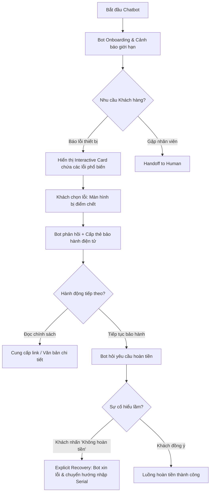

# BÁO CÁO KẾT QUẢ: GIAO DIỆN CHAT TƯƠNG TÁC & DESIGN RATIONALE

Họ và tên thành viên nhóm: Vũ Nhật Anh - 2A202600894, Nguyễn Lâm Phương Thảo - 2A202600873, Nguyễn Bình Huy - 2A202600689
Ngày thực hiện: 22/06/2026  
Dự án: Lab Day 18 - Thiết kế giao diện tương tác Người - Máy (Human-AI Interaction)

---
## 🔗 Liên kết & Hướng dẫn khởi chạy
### 1. Hướng dẫn khởi chạy cục bộ (Local Run)
Nếu giảng viên muốn chạy thử nghiệm trên máy cá nhân:
1. Mở terminal tại thư mục gốc của dự án.
2. Cài đặt các thư viện phụ thuộc bằng lệnh:
   ```bash
   npm install
   ```
3. Khởi chạy máy chủ phát triển bằng lệnh:
   ```bash
   npm run dev
   ```
4. Truy cập giao diện prototype tại địa chỉ trình duyệt: `http://localhost:5173/`
5. Slide Demo Day 20: [SLIDE_DAY20](<Thao/Smart TV AI Assistant Case Study.pdf>)
---

## 00 – Flow map và phạm vi tính năng

- **Mô tả**: Sơ đồ luồng nghiệp vụ chi tiết gồm 5 bước của hệ thống từ lúc đón tiếp người dùng cho đến khi giải quyết sự cố hoặc chuyển giao nhân viên kỹ thuật thực tế.
- **Minh chứng sơ đồ luồng**:
  
- **Minh chứng trên giao diện**:
  

---

## 01 – Onboarding

- **Mô tả (Step 0)**: Ngay khi khởi chạy ứng dụng, AI tự động gửi thông điệp chào đón và làm rõ giới hạn thẩm quyền của mình. Điều này giúp thiết lập kỳ vọng chính xác cho người dùng ngay từ đầu, giảm rủi ro hiểu nhầm.
- **Tin nhắn AI**: *"Chào bạn, tôi là AI Hỗ trợ. Tôi có thể tra cứu lỗi thiết bị và chính sách bảo hành. Tuy nhiên, tôi không có thẩm quyền tự động hoàn tiền..."*
- **Minh chứng giao diện**:
  

---

## 02 – Luồng chính / Trong hành động

- **Mô tả**: Luồng hoạt động chuẩn của trợ lý khi thu thập thông tin và cung cấp thông tin.
  - **Step 1 (Ask)**: Khi người dùng bấm báo lỗi, AI không tự đoán lỗi (tránh rủi ro hướng dẫn sai do chi phí lỗi cao) mà đưa ra các thẻ tương tác (`InteractiveCard`) để thu hẹp phạm vi.
  - **Step 2 (Act & Explainability)**: AI cung cấp thông tin chính sách bảo hành (rủi ro thấp nên được phép Act) kèm quote trích dẫn từ điều khoản cụ thể làm bằng chứng xác thực (`Explainability`).
- **Minh chứng giao diện (Step 1)**:
  
- **Minh chứng giao diện (Step 2)**:
  

---

## 03 – Sau hành động / Review / CSKH

- **Mô tả (Step 4)**: Khi người dùng nhập Serial tivi (ví dụ: `TV12345`), hệ thống phát hiện dữ liệu mâu thuẫn (hết hạn bảo hành trên hệ thống nhưng hóa đơn mua hàng hiển thị trong hạn). AI chọn không tự xử lý tiếp (Don't Act) để tránh lỗi và cung cấp nút kết nối trực tiếp với nhân viên kỹ thuật thực tế (`Handoff`) cùng toàn bộ bối cảnh cuộc trò chuyện.
- **Minh chứng giao diện**:
  
  

---

## 04 – Failure & Recovery

- **Mô tả (Step 3)**: Khi người dùng nhấn tiếp tục bảo hành, AI hiểu sai từ "thủ tục" thành "yêu cầu hoàn tiền". Hệ thống cung cấp nút sửa sai màu đỏ nổi bật *"Không, tôi không muốn hoàn tiền"* (`Explicit User Feedback`) để người dùng sửa lỗi hiểu nhầm của AI ngay lập tức và khôi phục luồng hội thoại quay lại đúng hướng bảo hành.
- **Minh chứng giao diện**:
  

---

## 05 – Feedback loop 2x2

- **Mô tả**: Dự án tích hợp đầy đủ 4 loại phản hồi trong ma trận 2x2:
  - **Explicit Positive**: Người dùng click chọn các option lỗi cụ thể ở Step 1.
  - **Explicit Negative**: Người dùng click nút sửa sai "Không, tôi không muốn hoàn tiền" ở Step 3.
  - **Implicit Positive**: Người dùng tiếp tục các bước hội thoại và nhập mã số Serial.
  - **Implicit Negative**: Hệ thống tự động nhận diện mâu thuẫn dữ liệu Serial ở Step 4, nhận thấy việc bắt người dùng nhập lại nhiều lần sẽ gây ức chế nên đã tự động dừng xử lý tự động và đề xuất Handoff.
- **Minh chứng giao diện**:
  

---

## 06 – Design rationale

- **Mô tả**: Sidebar bên phải (`RationaleCard`) hoạt động song song cùng luồng chat chính, tự động cập nhật và hiển thị rõ ràng lý do thiết kế, mức độ rủi ro, hành động của AI tương ứng với từng trạng thái của `currentStep`.
- **Minh chứng giao diện**:
  

---

## 07 – Demo path

- **Mô tả**: Để thuận tiện và nhanh chóng cho giảng viên chấm điểm, hệ thống hỗ trợ 2 chế độ demo:
  1. **Demo tự nhiên**: Người dùng click qua các nút tương tác từ Step 0 -> Step 4 để trải nghiệm toàn bộ luồng hội thoại.
  2. **Demo nhảy bước nhanh (Demo path)**: Giảng viên có thể click vào các Node số `0`, `1`, `2`, `3`, `4` trên thanh tiến trình ở Rationale Card phía Sidebar phải để lập tức chuyển bối cảnh lịch sử chat tương ứng với bước đó.
- **Video ghi hình Demo**:
  - *Video luồng tương tác chuẩn:*
    
  - *Video luồng Checklist tiêu chí:*
    


---

# PHẦN TỔNG HỢP LAB DAY 20 - RETENTION, MEASUREMENT & REDESIGN

# BẢN NHÁP LÝ THUYẾT & SLIDE: LUỒNG 1 — RETENTION STRATEGY & NATURE/NURTURE
**Họ và tên người thực hiện:** Nguyễn Bình Huy   
**Dự án:** Smart TV Repair & Warranty Virtual Assistant (AI Support Agent)

---

## 01 – Customer Retention Canvas (Bài 1)

Sản phẩm  là Trợ lý ảo AI hỗ trợ xử lý sự cố và hướng dẫn bảo hành thiết bị hiển thị Smart TV. Luồng use case chính được phân tích là **"Đăng ký sửa chữa bảo hành tại nhà khi Smart TV gặp lỗi phần cứng"**.

### 1.1. The Problem (Vấn đề của người dùng)
*   **Định nghĩa theo ngôn ngữ của người dùng (User's Voice):**  
    > *"Tivi nhà tôi đột nhiên bị sọc nhiễu màn hình và mất hình. Tôi không rõ máy có được bảo hành miễn phí hay không và phải liên hệ thế nào. Gọi điện lên tổng đài hãng thì lúc nào cũng báo bận hoặc phải chờ máy nhạc chờ rất lâu, còn tự lên mạng đọc các văn bản chính sách bảo hành bằng PDF thì quá dài dòng, phức tạp, chứa nhiều thuật ngữ kỹ thuật khó hiểu."*
*   **Điểm cần tránh (Không mô tả bằng tính năng):**  
    Không viết: *"Người dùng cần một hệ thống chatbot AI có tích hợp tra cứu chính sách bảo hành và form đăng ký sửa chữa tại nhà."* (Đây là mô tả giải pháp/tính năng, không phải vấn đề của khách hàng).

### 1.2. The Persona (Chân dung khách hàng)
*   **Mô tả cụ thể:**  
    *   **Đối tượng:** Chủ sở hữu Smart TV trong gia đình (Tuổi từ 25 - 60, sống tại các hộ gia đình đô thị).
    *   **Hoàn cảnh:** Người bận rộn đi làm cả ngày, sử dụng tivi như công cụ giải trí chính của gia đình vào buổi tối. Không có chuyên môn kỹ thuật sâu về sửa chữa đồ điện tử.
    *   **Mục tiêu:** Muốn kiểm tra ngay tivi bị hỏng có được bảo hành miễn phí không, và đăng ký lịch hẹn thợ kỹ thuật của hãng đến sửa chữa tận nhà nhanh nhất có thể.

### 1.3. Anti-persona (Chân dung đối lập)
*   **Mô tả cụ thể:**  
    *   Thợ sửa tivi tự do hoặc các cửa hàng sửa chữa điện tử cũ (họ tự khắc phục sự cố để bán lại, không có nhu cầu liên hệ bảo hành chính hãng).
    *   Khách hàng đang tìm kiếm thông tin để mua tivi mới (không gặp sự cố tivi hỏng và không thuộc đối tượng của luồng bảo hành này).
*   **Vai trò:** Giúp đội phát triển tránh bị lẫn lộn dữ liệu hành vi của những nhóm người dùng không mang lại giá trị hoặc có hành vi bất thường.

### 1.4. The Why (Động lực cốt lõi)
*   **Động lực:** Tiết kiệm tối đa công sức và thời gian tìm kiếm thông tin bảo hành chính xác; có được sự đảm bảo chính thức từ hãng (thời gian, chi phí sửa) để nhanh chóng khôi phục hoạt động giải trí cho gia đình.

### 1.5. The Alternative (Giải pháp thay thế hiện tại)
*   Gọi lên số hotline chăm sóc khách hàng của hãng Smart TV (mất thời gian chờ kết nối máy lẻ).
*   Tra cứu thông tin chính sách bảo hành trên Google hoặc đọc file tài liệu PDF điều khoản dịch vụ (gặp khó khăn do văn bản dài dòng và nhiều thuật ngữ chuyên môn).
*   Tự tháo dỡ tivi cồng kềnh mang ra trung tâm sửa chữa bảo hành (tốn công sức vận chuyển, có rủi ro bể vỡ dọc đường).
*   Chấp nhận bỏ tiền túi ra gọi thợ sửa chữa bên ngoài tự do (tốn kém chi phí mặc dù tivi có thể vẫn nằm trong hạn bảo hành).

### 1.6. The Frequency (Tần suất tự nhiên của vấn đề)
*   **Tần suất:** **Rất thấp (Infrequent/Yearly)** - Lỗi hỏng hóc phần cứng nặng của tivi (như sọc màn hình, chết panel) thường chỉ xảy ra 1 đến vài năm một lần. Người dùng không bao giờ gặp vấn đề này hàng ngày hoặc hàng tuần.

---

## 02 – Core Action & Active User (Bài 2)

### 2.1. Xác định Core Action (Hành động cốt lõi)
*   **Core Job:** Giải quyết sự cố tivi bị lỗi phần cứng bằng phương án sửa chữa bảo hành chính hãng.
*   **Core Action:** **Gửi thành công yêu cầu sửa chữa bảo hành tại nhà (Submit home service request)** hoặc **Xác nhận lịch kết nối CSKH hỗ trợ trực tiếp (Confirm support handoff connection)**.
*   **Vì sao hành động này cho thấy user thực sự nhận được value?**  
    Hành động này chứng minh người dùng đã vượt qua mọi rào cản về mặt tra cứu chính sách bảo hành phức tạp và chính thức đạt được giải pháp thực tế: Hãng đã ghi nhận sự cố, xác minh quyền lợi bảo hành miễn phí và chốt lịch kỹ thuật viên đến tận nhà kiểm tra/sửa chữa.
*   **Khi nào được tính là đã xảy ra?**  
    Khi hệ thống backend ghi nhận sự kiện `service_request_submitted` thành công (ở cuối luồng đăng ký hoặc khi người dùng click kết nối handoff thành công và hệ thống chuyển bối cảnh đi).

### 2.2. Định nghĩa Active User (Người dùng hoạt động)
*   Một người dùng được tính là **Active User** khi họ thực hiện **hoàn thành ít nhất 1 lượt kiểm tra bảo hành thiết bị** hoặc **gửi thành công 1 yêu cầu hỗ trợ kỹ thuật** trong **vòng 30 ngày (Monthly Active User - MAU)**.
*   **Lý giải:** Không tính active theo ngày (DAU) hay tuần (WAU) vì tần suất lỗi tivi là rất thấp. Định nghĩa theo chu kỳ 30 ngày phản ánh đúng nhịp sử dụng tự nhiên của việc xử lý sự cố thiết bị gia dụng.

---

## 03 – Natural Frequency & Retention Metric (Bài 2)

### 3.1. Chọn Retention Metric theo Natural Frequency
*   Do tần suất tự nhiên của việc hỏng tivi rất thấp (Yearly), chúng ta không thể sử dụng các chỉ số Retention truyền thống như **D1, D7 hoặc D30 Retention** cho sản phẩm CSKH thuần túy này (khách hàng sẽ rời đi ngay sau khi tivi được sửa xong và không quay lại cho đến khi tivi hỏng tiếp sau vài năm).
*   **Chỉ số lựa chọn phù hợp:** **Monthly Cohort Retention** (đo lường tỷ lệ nhóm người dùng quay lại ứng dụng mỗi tháng) kết hợp mở rộng sản phẩm sang các tính năng chăm sóc thiết bị định kỳ.
*   **Chỉ số Stickiness:** Sử dụng **WAU/MAU** hoặc **MAU** làm chỉ số đo lường mức độ tương tác sức khỏe lâu dài của dịch vụ chăm sóc khách hàng.

---

## 09 – Nature vs Nurture (Bài 5)

### 9.1. Nature (Nhịp tự nhiên)
*   Khách hàng chỉ tự tìm đến sản phẩm khi thiết bị tivi gặp sự cố hỏng hóc hoặc cần tra cứu chính sách bảo hành đột xuất (tần suất trung bình: 1 - 2 lần/năm).

### 9.2. Nurture (Hoạt động nuôi dưỡng chủ động của sản phẩm)
Để duy trì sự hiện diện của ứng dụng trong đời sống khách hàng và kéo dài vòng đời tương tác, sản phẩm chủ động thực hiện các hoạt động nuôi dưỡng sau:

*   **Nhắc nhở bảo trì tivi định kỳ (In-app Maintenance Alerts):** Gửi thông báo nhắc nhở người dùng chạy tính năng làm sạch điểm ảnh màn hình (Pixel Cleaning) định kỳ mỗi 6 tháng trên Smart TV OLED để tránh lỗi bóng mờ (burn-in).
*   **Gợi ý tối ưu hình ảnh/âm thanh:** Gợi ý cách thiết lập thông số hiển thị tối ưu theo từng mùa bóng đá hoặc nâng cấp phần mềm tivi định kỳ.
*   **Nhắc nhở gia hạn bảo hành:** Gửi thông báo gửi ưu đãi gói bảo hành mở rộng (Extended Warranty) 1 tháng trước khi thời hạn bảo hành gốc 12 tháng của tivi kết thúc.

### 9.3. Bảng phân tích Nature vs Nurture đề xuất

| Nội dung | Câu trả lời của nhóm |
| :--- | :--- |
| **Natural frequency của use case** | Rất thấp (Yearly/Infrequent) - chỉ xảy ra khi tivi bị hỏng phần cứng. |
| **Internal trigger (Kích hoạt nội tại)** | Cảm giác lo lắng màn hình đắt tiền bị sọc hỏng hoặc mong muốn nhanh chóng sửa tivi để cả gia đình tiếp tục giải trí. |
| **External trigger hiện có** | Thông báo nhắc nhở chạy pixel cleaning bảo trì màn hình định kỳ phát trên tivi/điện thoại. |
| **Một hoạt động nurture phù hợp** | Gửi thông báo định kỳ 6 tháng chạy quét dọn điểm ảnh để tối ưu chất lượng màn hình OLED, kéo dài tuổi thọ tivi. |
| **Vì sao nurture không quá dày hoặc quá thưa?** | Không được quá dày (ví dụ gửi hàng tuần) vì tivi không cần bảo trì liên tục, sẽ gây phiền hà làm user xóa app. Không quá thưa (nhu cầu thấp) vì user sẽ quên app. Mức **mỗi 6 tháng** là hợp lý. |
| **Metric dùng để theo dõi tác động** | Tỷ lệ nhấp chuột vào thông báo chạy bảo trì (`maintenance_click_rate`) và tỷ lệ quay lại chạy pixel cleaning hàng tháng (`monthly_pixel_clean_rate`). |


# BẢN NHÁP LÝ THUYẾT LUỒNG 2: UX AUDIT, ONBOARDING REDESIGN & HOOK MODEL
**Người phụ trách:** Nhật Anh

---

## 1. Onboarding Audit (Bài 3)
Phân tích ma sát của luồng chatbot Ngày 18 theo các nhãn:
- **Keep (Giữ lại):** 
  - Nút "Gặp nhân viên thật" (Handoff) ở góc phải. (Lý do: Tạo sự an tâm (Implicit System Feedback), cho phép khách hàng kiểm soát quyền thoát khỏi bot bất cứ lúc nào).
  - Tin nhắn Onboarding rõ ràng chức năng và giới hạn của bot ("Tôi có thể tra cứu... Tôi không có quyền tự động hoàn tiền").
- **Remove (Loại bỏ):**
  - Các bước bắt người dùng gõ văn bản dài để mô tả lỗi. (Lý do: Tốn thời gian, dễ gây hiểu lầm ngữ nghĩa, tạo ma sát cao).
  - Luồng bot tự phán đoán lỗi mà không có sự xác nhận của người dùng.
- **Delay (Trì hoãn):**
  - Việc yêu cầu mã Serial. (Lý do: Bắt khách hàng nhập một chuỗi ký tự khó nhớ ngay từ đầu sẽ làm rớt (drop) khách hàng. Chỉ yêu cầu khi đã xác định được luồng cần xử lý bảo hành).
- **Simplify (Đơn giản hóa):**
  - Chuyển việc mô tả lỗi từ nhập liệu văn bản tự do (free-text) sang các nút chọn (InteractiveCard - Ask Action) để giảm thiểu Effort của khách hàng và rủi ro AI hiểu sai.

---

## 2. Redesigned Journey (Bài 3)
Sơ đồ hành trình mới tập trung vào sự tối giản và giảm thiểu chi phí sửa sai:



---

## 3. Bảng Before/After & Recovery (Bài 3)

| Tiêu chí | Hành trình cũ (Ngày 18) | Hành trình mới (Thiết kế lại) |
| :--- | :--- | :--- |
| **Nhập liệu** | Bắt khách hàng tự gõ text (Ví dụ: "Tivi nhà tôi tự dưng bị đen xì nhưng vẫn nghe thấy tiếng"). | Cung cấp các nút lỗi phổ biến (Interactive Card). Rất nhanh và chính xác. |
| **Bằng chứng giải thích** | Bot chỉ trích dẫn dạng Text thô. Trông thiếu chuyên nghiệp và không đủ độ tin cậy. | Hiển thị thẻ **Digital Warranty Card** bắt mắt với đầy đủ thông tin bảo hành và trích dẫn chuẩn xác. |
| **Luồng phục hồi lỗi (Recovery)** | Bot cứ tiếp tục làm tới, khách phải gõ lại từ đầu để quay lại luồng. | Thiết kế **Explicit Feedback Button**: "Không, tôi không muốn hoàn tiền". Nhấn vào là bot tự động quay xe, xin lỗi và chuyển luồng đúng. |
| **Trải nghiệm gõ mã Serial** | Bot bắt nhập liền. Mất thời gian. Nếu lỗi, bắt nhập lại n lần. | Bot chỉ hỏi khi cần. Nếu mâu thuẫn hệ thống, bot tự động dừng (Don't Act) và chuyển cho nhân sự (Handoff) kèm theo toàn bộ bối cảnh để khách không phải kể lại. |

---

## 4. Hook Model (Bài 5.2)
Thiết kế vòng lặp tạo thói quen sử dụng Smart TV thay vì các thiết bị giải trí khác:

1. **Trigger (Yếu tố kích hoạt):**
   - *Internal Trigger:* Khách hàng cảm thấy chán nản sau một ngày làm việc mệt mỏi, muốn xem gì đó giải trí cùng gia đình ở màn hình lớn, âm thanh sống động.
   - *External Trigger:* Thông báo (Notification) trên điện thoại về "Tập mới của series bạn đang theo dõi đã lên sóng" hoặc "Gợi ý phim cuối tuần".
2. **Action (Hành động):**
   - Hành động siêu dễ dàng: Bật TV bằng một nút bấm duy nhất trên Remote (Nút Netflix/YouTube tích hợp sẵn) hoặc điều khiển bằng giọng nói.
3. **Reward (Phần thưởng):**
   - *Reward of the Hunt:* Khám phá ra một bộ phim hay/nội dung mới lạ nhờ thuật toán đề xuất (Recommendation Engine). Trải nghiệm hình ảnh 4K sắc nét và âm thanh vòm ngay lập tức mang lại sự thỏa mãn.
4. **Investment (Đầu tư):**
   - Khách hàng dành thời gian đăng nhập tài khoản cá nhân, thêm phim vào "Danh sách xem sau" (Watchlist), hoặc thiết lập không gian màu sắc (Picture Mode) yêu thích. Những hành động này làm cho hệ thống hiểu họ hơn, cá nhân hóa nội dung tốt hơn, làm tăng khả năng họ sẽ quay lại sử dụng TV (Trigger lần sau).


# BÁO CÁO LUỒNG 3 — MEASUREMENT, QR SCANNER & TRACKING PLAN

**Người thực hiện:** Nguyễn Lâm Phương Thảo — 2A202600873
**Dự án:** Smart TV Repair & Warranty Virtual Assistant
**Sản phẩm:** AI Customer Support Agent hỗ trợ xử lý lỗi và bảo hành Smart TV
**Phạm vi phụ trách:** Measurement Ladder, North Star Metric, Metric Tracking Plan, QR Scanner mockup, Real-time Tracking Simulator và tổng hợp slide cuối.

---

## 07 — Measurement Ladder

### 7.1. Mục tiêu đo lường

Vì sản phẩm là AI Customer Support Agent cho tình huống Smart TV gặp lỗi phần cứng, mục tiêu đo lường không phải là tăng số lượt mở app hằng ngày. Use case chính có tần suất tự nhiên thấp, thường chỉ xảy ra khi người dùng gặp lỗi thiết bị, cần kiểm tra bảo hành hoặc cần chuyển sang nhân viên kỹ thuật.

Do đó, hệ thống đo lường tập trung vào 4 câu hỏi chính:

1. Người dùng có được đưa tới đúng hướng xử lý bảo hành không?
2. Người dùng có hoàn thành bước cung cấp thông tin thiết bị không?
3. AI có biết dừng lại và chuyển nhân viên thật khi dữ liệu không chắc chắn không?
4. Luồng hỗ trợ có giảm ma sát và rút ngắn thời gian tới giá trị không?

### 7.2. Measurement Ladder đề xuất

| Tầng đo lường                 | Metric đề xuất                                                            | Ý nghĩa                                                                                                         |
| :---------------------------- | :------------------------------------------------------------------------ | :-------------------------------------------------------------------------------------------------------------- |
| **Marketing / Traffic**       | Số lượt mở chatbot hỗ trợ                                                 | Đo lượng người dùng bắt đầu tìm tới kênh hỗ trợ AI.                                                             |
| **Visitor**                   | Số người dùng bắt đầu báo lỗi thiết bị                                    | Cho biết bao nhiêu người dùng thật sự có nhu cầu hỗ trợ kỹ thuật.                                               |
| **Activation**                | Tỷ lệ người dùng nhận được hướng xử lý bảo hành đầu tiên                  | Đo việc người dùng đã nhận được giá trị ban đầu, ví dụ thấy chính sách bảo hành hoặc hướng xử lý có bằng chứng. |
| **Core Action**               | Số lượt xác nhận handoff hoặc gửi yêu cầu hỗ trợ kỹ thuật thành công      | Cho biết người dùng đã đi tới hành động có giá trị thực tế.                                                     |
| **Retention**                 | Monthly Cohort Retention cho nhóm người dùng quay lại dùng hỗ trợ/bảo trì | Phù hợp với tần suất thấp của use case bảo hành thiết bị.                                                       |
| **Business / Customer Value** | Giảm thời gian xử lý ticket, giảm tải tổng đài, tăng CSAT                 | Đo hiệu quả dài hạn đối với doanh nghiệp và trải nghiệm khách hàng.                                             |

### 7.3. Lý do không chọn DAU làm metric chính

Sự cố phần cứng Smart TV không xảy ra hằng ngày. Nếu dùng DAU làm chỉ số chính, nhóm có thể bị lệch mục tiêu và cố tạo tương tác giả tạo không cần thiết. Với sản phẩm chăm sóc khách hàng, chỉ số quan trọng hơn là chất lượng xử lý sự cố, tỷ lệ đi tới đúng hướng hỗ trợ và khả năng chuyển giao an toàn khi AI không chắc chắn.

---

## 08 — North Star Metric & Input Metrics

### 8.1. North Star Metric

**North Star Metric đề xuất:**
**Monthly Verified Warranty Support Resolutions**

### 8.2. Định nghĩa North Star Metric

Một lượt được tính là **Verified Warranty Support Resolution** khi người dùng hoàn thành ít nhất một trong các kết quả sau:

1. Nhận được hướng xử lý bảo hành rõ ràng kèm bằng chứng chính sách.
2. Quét hoặc nhập serial thành công để hệ thống kiểm tra tình trạng bảo hành.
3. Được chuyển sang nhân viên thật khi dữ liệu mâu thuẫn hoặc AI không đủ chắc chắn để tự xử lý.

Metric này phản ánh đúng giá trị cốt lõi của sản phẩm: giúp người dùng đang gặp lỗi Smart TV đi tới hướng giải quyết đáng tin cậy, thay vì chỉ nhận câu trả lời chung chung.

### 8.3. Input Metrics

| Input Metric                    | Định nghĩa                                                                                                   | Vì sao tác động tới North Star                                                      |
| :------------------------------ | :----------------------------------------------------------------------------------------------------------- | :---------------------------------------------------------------------------------- |
| **Activation Rate**             | Tỷ lệ người dùng đi từ onboarding tới first value, ví dụ thấy chính sách bảo hành hoặc hướng xử lý đầu tiên. | Nếu activation thấp, người dùng rời đi trước khi nhận được giá trị.                 |
| **Serial Capture Success Rate** | Tỷ lệ người dùng cung cấp được serial bằng nhập tay hoặc quét QR.                                            | Serial là dữ liệu quan trọng để kiểm tra bảo hành và xử lý chính xác.               |
| **Handoff Confirmation Rate**   | Tỷ lệ người dùng đồng ý chuyển sang nhân viên thật khi AI phát hiện dữ liệu mâu thuẫn.                       | Cho thấy luồng “Don’t Act” và chuyển giao có đủ rõ ràng, đáng tin và hữu ích không. |

### 8.4. Leading và Lagging Indicators

| Loại chỉ số           | Metric                                         | Giải thích                                                          |
| :-------------------- | :--------------------------------------------- | :------------------------------------------------------------------ |
| **Leading Indicator** | Activation Rate                                | Báo hiệu sớm onboarding và flow hỗ trợ có đưa user tới value không. |
| **Leading Indicator** | Serial Capture Success Rate                    | Báo hiệu QR Scanner hoặc form nhập serial có giảm ma sát không.     |
| **Leading Indicator** | Handoff Confirmation Rate                      | Báo hiệu user có tin tưởng quyết định chuyển nhân viên thật không.  |
| **Lagging Indicator** | CSAT                                           | Phản ánh mức độ hài lòng sau khi trải nghiệm kết thúc.              |
| **Lagging Indicator** | Average Resolution Time                        | Phản ánh thời gian xử lý sự cố sau khi hệ thống vận hành.           |
| **Lagging Indicator** | Ticket Deflection / Call Center Load Reduction | Phản ánh hiệu quả kinh doanh dài hạn.                               |

### 8.5. Trade-off cần theo dõi

Trade-off quan trọng nhất là giữa **tự động hóa** và **an toàn khi xử lý sự cố**.

Nếu AI chuyển handoff quá sớm, hệ thống an toàn hơn nhưng có thể làm tăng tải cho nhân viên thật. Ngược lại, nếu AI cố tự xử lý quá nhiều, tổng đài có thể giảm tải ngắn hạn nhưng rủi ro tư vấn sai, hiểu nhầm chính sách hoặc làm khách hàng mất niềm tin sẽ tăng lên.

Vì vậy, sản phẩm cần theo dõi đồng thời:

* Handoff Confirmation Rate.
* Serial Conflict Detection Rate.
* CSAT sau handoff.
* Tỷ lệ người dùng phải lặp lại thông tin sau khi chuyển nhân viên thật.

---

## 11 — Metric Tracking Requirement

### 11.1. Bảng định nghĩa metric

| Metric                          | Câu hỏi cần trả lời                                      | Định nghĩa                                                                             | Công thức                                                        | Window      | Segment                          | Event cần có                                                                |
| :------------------------------ | :------------------------------------------------------- | :------------------------------------------------------------------------------------- | :--------------------------------------------------------------- | :---------- | :------------------------------- | :-------------------------------------------------------------------------- |
| **Activation Rate**             | Bao nhiêu user nhận được giá trị đầu tiên?               | User được xem hướng xử lý bảo hành hoặc chính sách bảo hành có bằng chứng.             | `warranty_policy_shown / onboarding_started`                     | Monthly     | Người dùng báo lỗi Smart TV      | `onboarding_started`, `warranty_policy_shown`                               |
| **Serial Capture Success Rate** | Bao nhiêu user cung cấp được serial thành công?          | User nhập tay hoặc quét QR thành công serial thiết bị.                                 | `(serial_qr_scanned + serial_manual_entered) / serial_requested` | Monthly     | Người dùng cần kiểm tra bảo hành | `serial_requested`, `serial_qr_scanned`, `serial_manual_entered`            |
| **Handoff Confirmation Rate**   | Khi AI đề xuất gặp nhân viên thật, user có đồng ý không? | User bấm xác nhận chuyển nhân viên sau khi AI phát hiện dữ liệu mâu thuẫn.             | `handoff_confirmed / handoff_offered`                            | Monthly     | Session có serial conflict       | `handoff_offered`, `handoff_confirmed`                                      |
| **Time to Value**               | Người dùng mất bao lâu để nhận được giá trị đầu tiên?    | Thời gian từ lúc onboarding bắt đầu tới lúc user thấy chính sách/hướng xử lý đầu tiên. | `timestamp(first_value_event) - timestamp(onboarding_started)`   | Per session | Tất cả session hỗ trợ            | `onboarding_started`, `warranty_policy_shown`, `handoff_offered`            |
| **Recovery Success Rate**       | Khi AI hiểu sai, user có sửa được luồng không?           | User bấm nút sửa sai và hệ thống quay lại đúng hướng xử lý.                            | `receipt_shown / refund_misunderstanding_shown`                  | Monthly     | Session có AI misunderstanding   | `refund_misunderstanding_shown`, `refund_recovery_clicked`, `receipt_shown` |

---

### 11.2. Bảng tracking event

| Event name                      | Event được ghi khi nào?                                         | User identity           | Properties                                   | Metric sử dụng event           | Cách tránh ghi trùng                            |
| :------------------------------ | :-------------------------------------------------------------- | :---------------------- | :------------------------------------------- | :----------------------------- | :---------------------------------------------- |
| `onboarding_started`            | Khi chatbot gửi lời chào đầu tiên ở Step 0.                     | `user_id`, `session_id` | `surface`, `source`, `step`                  | Activation Rate, Time to Value | Chỉ ghi 1 lần cho mỗi session.                  |
| `issue_reported`                | Khi user báo lỗi màn hình.                                      | `user_id`, `session_id` | `issue_text`, `step`                         | Funnel analysis                | Không ghi lại khi reload trang.                 |
| `issue_type_selected`           | Khi user chọn loại lỗi, ví dụ “Điểm chết/Sọc”.                  | `user_id`, `session_id` | `issue_type`, `selection_label`              | Activation Rate                | Chỉ ghi khi user click lựa chọn thật.           |
| `warranty_policy_shown`         | Khi AI hiển thị chính sách bảo hành hoặc Digital Warranty Card. | `user_id`, `session_id` | `policy_type`, `evidence_shown`, `ai_action` | Activation Rate, Time to Value | Chỉ ghi khi card thật sự render lần đầu.        |
| `refund_misunderstanding_shown` | Khi AI hiểu sai ý định và hiện luồng hoàn tiền.                 | `user_id`, `session_id` | `misunderstood_intent`, `actual_intent`      | Recovery Success Rate          | Chỉ ghi 1 lần cho cùng một misunderstanding.    |
| `refund_recovery_clicked`       | Khi user bấm “Không, tôi không muốn hoàn tiền”.                 | `user_id`, `session_id` | `button_label`, `recovery_type`              | Recovery Success Rate          | Chỉ ghi khi user click nút.                     |
| `receipt_shown`                 | Khi hệ thống sửa lỗi và hiển thị biên lai/hướng xử lý đúng.     | `user_id`, `session_id` | `document_type`, `recovery_success`          | Recovery Success Rate          | Chỉ ghi khi recovery thành công.                |
| `qr_scanner_opened`             | Khi user bấm nút quét QR ở Step 4.                              | `user_id`, `session_id` | `entry_point`, `method`                      | Serial Capture Success Rate    | Ghi mỗi lần mở modal, phân biệt bằng timestamp. |
| `serial_qr_scanned`             | Khi QR mock scan thành công và trả về serial.                   | `user_id`, `session_id` | `serial_masked`, `entry_method`, `source`    | Serial Capture Success Rate    | Không ghi trùng cùng serial trong cùng session. |
| `serial_lookup_started`         | Khi hệ thống bắt đầu kiểm tra serial.                           | `user_id`, `session_id` | `serial_masked`, `entry_method`              | Time to Value, Funnel analysis | Chỉ ghi khi lookup thật sự bắt đầu.             |
| `serial_conflict_detected`      | Khi hệ thống phát hiện dữ liệu bảo hành mâu thuẫn.              | `user_id`, `session_id` | `conflict_type`, `ai_action`                 | Handoff Confirmation Rate      | Chỉ ghi 1 lần cho cùng serial conflict.         |
| `handoff_offered`               | Khi AI đề xuất chuyển sang nhân viên thật.                      | `user_id`, `session_id` | `reason`, `context_included`                 | Handoff Confirmation Rate      | Chỉ ghi khi card handoff xuất hiện.             |
| `handoff_confirmed`             | Khi user xác nhận gặp nhân viên thật.                           | `user_id`, `session_id` | `reason`, `context_included`                 | Handoff Confirmation Rate      | Chỉ ghi khi user click xác nhận.                |

---

### 11.3. Event map gắn với flow

```text
Step 0 — Onboarding
[event] onboarding_started

Step 1 — User báo lỗi màn hình
[event] issue_reported
[event] issue_type_selected

Step 2 — AI đưa chính sách bảo hành có bằng chứng
[event] warranty_policy_shown

Step 3 — AI hiểu sai ý định thành hoàn tiền
[event] refund_misunderstanding_shown

User sửa sai bằng nút “Không, tôi không muốn hoàn tiền”
[event] refund_recovery_clicked
[event] receipt_shown

Step 4 — User cung cấp Serial
[event] qr_scanner_opened
[event] serial_qr_scanned
[event] serial_lookup_started

AI phát hiện dữ liệu mâu thuẫn
[event] serial_conflict_detected
[event] handoff_offered

User đồng ý gặp nhân viên thật
[event] handoff_confirmed
```

---

### 11.4. Acceptance Criteria cho tracking

| Mã      | Tiêu chí nghiệm thu                                | Mô tả                                                                                                                                                               |
| :------ | :------------------------------------------------- | :------------------------------------------------------------------------------------------------------------------------------------------------------------------ |
| **AC1** | Event chỉ ghi khi hành vi thật sự xảy ra           | `serial_qr_scanned` chỉ được ghi sau khi QR mock scan trả về serial thành công, không ghi ngay khi modal vừa mở.                                                    |
| **AC2** | Refresh hoặc click lặp không làm sai dữ liệu chính | Các event một lần như `onboarding_started`, `warranty_policy_shown`, `serial_conflict_detected` cần tránh ghi trùng trong cùng session.                             |
| **AC3** | Event có đủ identity và properties                 | Mỗi event phải có `user_id`, `session_id`, `timestamp`, `current_step` và `properties`.                                                                             |
| **AC4** | Event dùng được để tính metric đã định nghĩa       | `warranty_policy_shown` dùng cho Activation Rate, `serial_qr_scanned` dùng cho Serial Capture Success Rate, `handoff_confirmed` dùng cho Handoff Confirmation Rate. |
| **AC5** | Không thu thập dữ liệu cá nhân không cần thiết     | Serial nên được mask hoặc chỉ dùng serial mẫu trong prototype. Không lưu số điện thoại, địa chỉ, tài khoản ngân hàng hoặc thông tin nhạy cảm nếu không cần.         |
| **AC6** | Timestamp và timezone nhất quán                    | Tất cả event dùng timestamp ISO để sắp xếp thứ tự và tính Time to Value chính xác.                                                                                  |

---

## 12 — Demo Path & Prototype Evidence

### 12.1. QR Scanner Mockup

Để giảm ma sát khi người dùng phải nhập serial tivi thủ công, prototype bổ sung chức năng **Quét mã QR trên tem bảo hành** ở Step 4.

Trong phiên bản prototype, QR Scanner là giả lập kỹ thuật, không dùng camera thật. Khi người dùng bấm nút quét, hệ thống mở modal mô phỏng quá trình scan và trả về serial mẫu `TV12345`. Serial này được đưa vào cùng luồng kiểm tra Step 4. Sau đó hệ thống phát hiện dữ liệu mâu thuẫn và đề xuất chuyển sang nhân viên thật.

**Lý do thiết kế:**

* Giảm lỗi nhập sai serial.
* Giảm số thao tác thủ công.
* Tăng khả năng người dùng hoàn thành bước kiểm tra bảo hành.
* Minh họa rõ metric `Serial Capture Success Rate`.

**Minh chứng cần chèn:**

```text
[Ảnh 1] Step 4 có nút “Quét mã QR trên tem bảo hành”
[Ảnh 2] QR Scanner Modal đang quét hoặc quét thành công
[Ảnh 3] Sau khi quét QR, chatbot chuyển sang serial conflict và handoff
```

---

### 12.2. Real-time Tracking Simulator

Prototype bổ sung tab **Tracking Logs** ở sidebar phải. Tab này hiển thị event JSON realtime khi người dùng tương tác với chatbot.

Mỗi event gồm các trường chính:

```json
{
  "id": "event_id",
  "event_name": "serial_qr_scanned",
  "timestamp": "2026-06-24T04:27:23.566Z",
  "user_id": "demo_user_001",
  "session_id": "demo_session_001",
  "current_step": 4,
  "properties": {
    "entry_method": "qr",
    "source": "qr_scanner_modal"
  }
}
```

**Lý do thiết kế:**

* Giúp giảng viên thấy rõ event nào được ghi ở từng bước.
* Minh họa cách metric trong tracking plan được chuyển thành dữ liệu cụ thể.
* Cho thấy hệ thống có cơ chế tránh ghi nhận mơ hồ hoặc chỉ dựa trên cảm tính.
* Không dùng analytics thật, chỉ là simulator phục vụ prototype.

**Minh chứng cần chèn:**

```text
[Ảnh 4] Tracking Logs hiển thị event JSON realtime
[Ảnh 5] Event qr_scanner_opened / serial_qr_scanned / handoff_offered
```

---

### 12.3. Demo path phần Luồng 3

1. Đi tới Step 4 sau khi user sửa lỗi AI hiểu sai ở Step 3.
2. User chọn **Quét mã QR trên tem bảo hành**.
3. QR Scanner Modal mở ra và trả về serial mẫu.
4. Hệ thống ghi event `qr_scanner_opened`, `serial_qr_scanned`, `serial_lookup_started`.
5. AI phát hiện serial conflict và chọn **Don’t Act**.
6. AI đề xuất handoff sang nhân viên thật.
7. Tracking Logs hiển thị đầy đủ event JSON.
8. User xác nhận handoff, hệ thống ghi `handoff_confirmed`.

---

## Kết luận Luồng 3

Phần Luồng 3 bổ sung lớp đo lường và giả lập kỹ thuật cho prototype Day 20. QR Scanner giúp giảm ma sát ở bước nhập Serial, còn Tracking Logs Simulator cho thấy cách hệ thống ghi nhận hành vi người dùng thành dữ liệu có thể đo được.

Các chỉ số được chọn không tập trung vào lượt truy cập hằng ngày mà tập trung vào giá trị thật của use case: người dùng nhận được hướng xử lý bảo hành đáng tin cậy, cung cấp được thông tin thiết bị, và được chuyển sang nhân viên thật khi AI không đủ chắc chắn.

Nhờ đó, phần đo lường kết nối trực tiếp với mục tiêu sản phẩm, trải nghiệm người dùng và yêu cầu tracking của bài lab.

